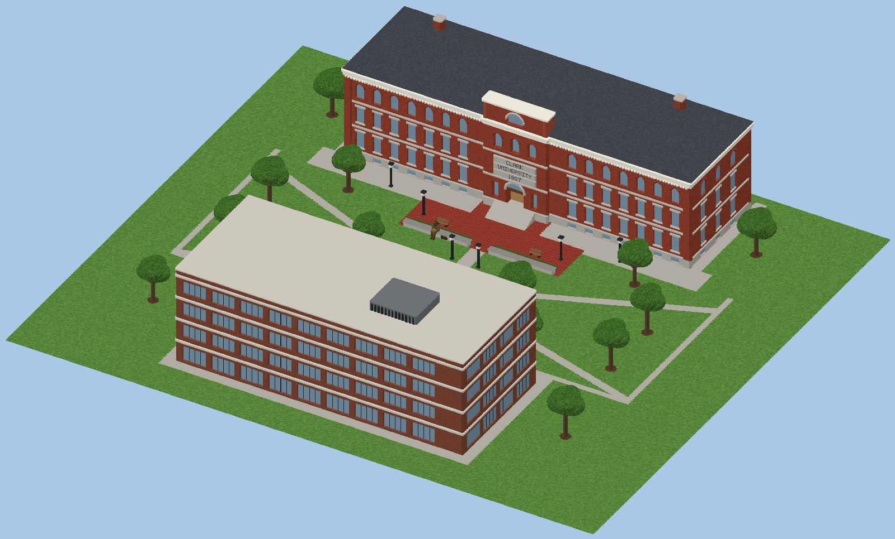
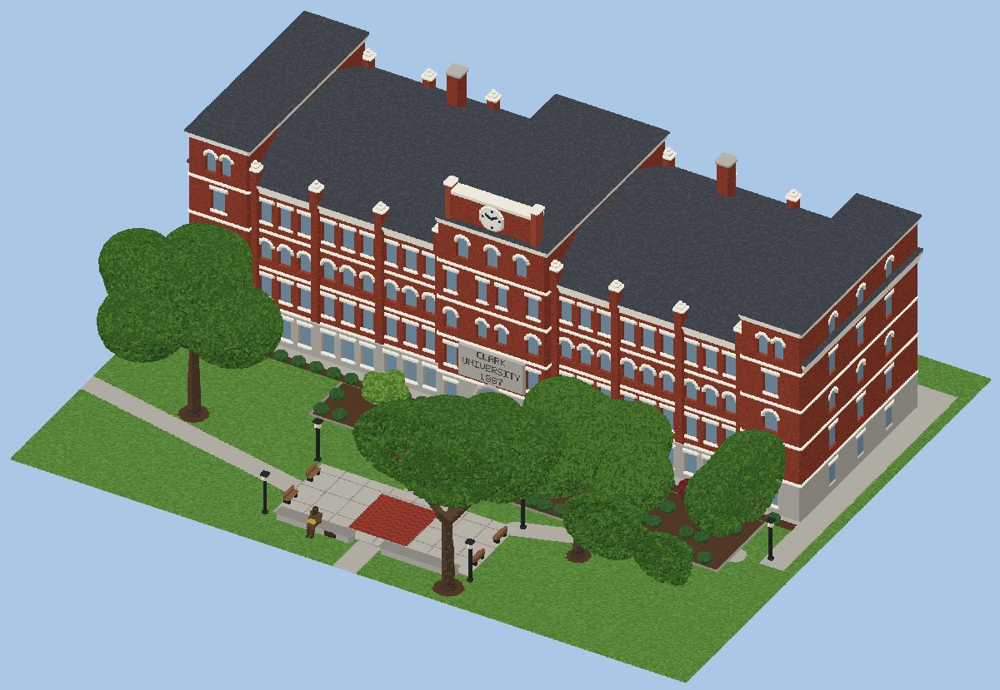
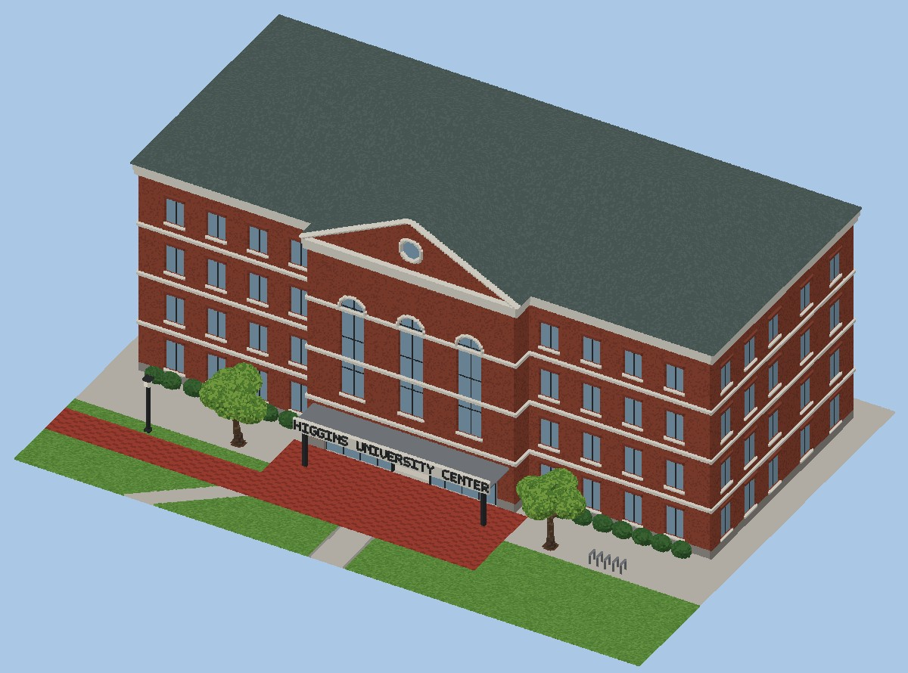
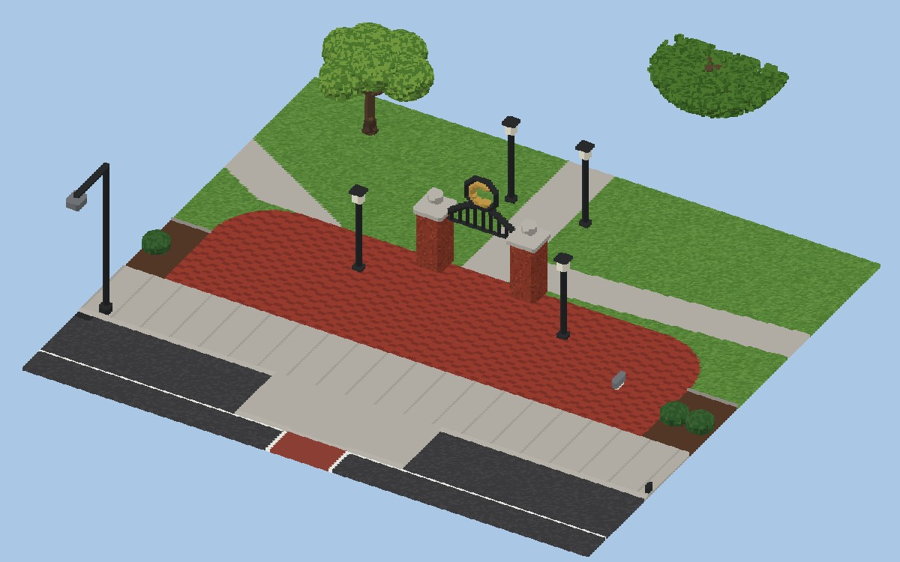
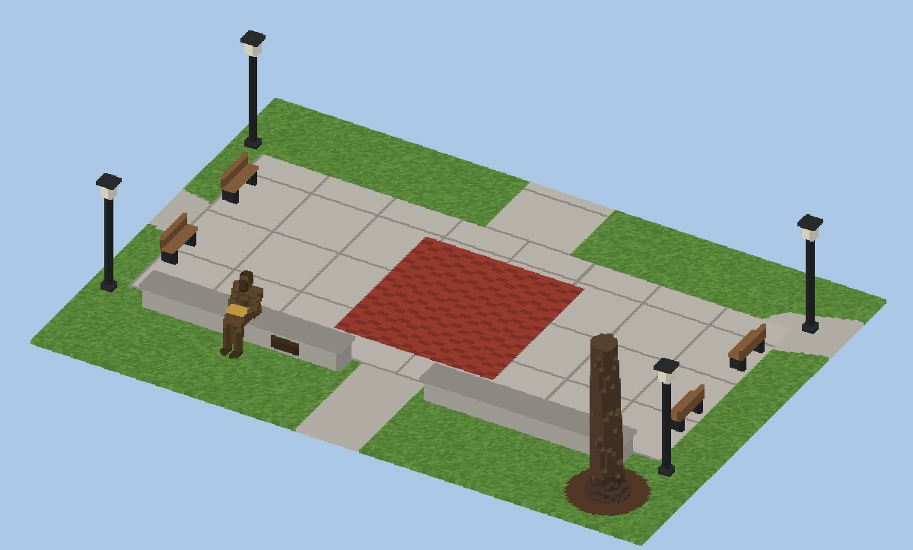
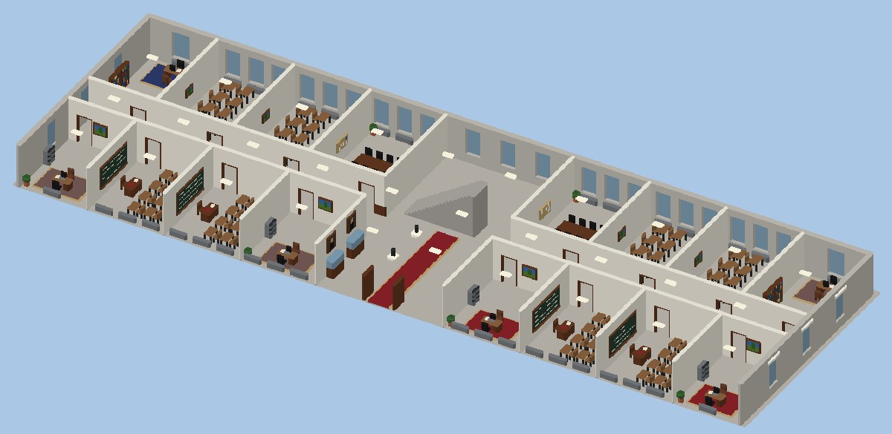
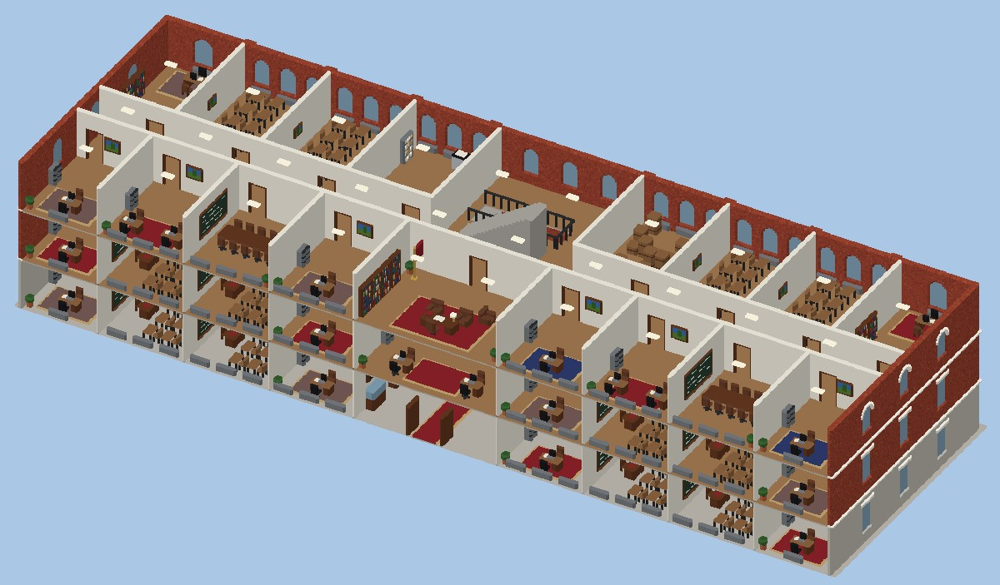
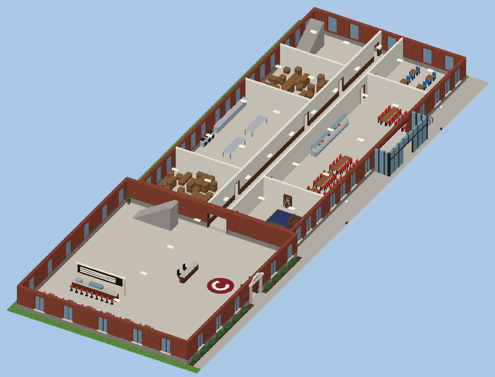
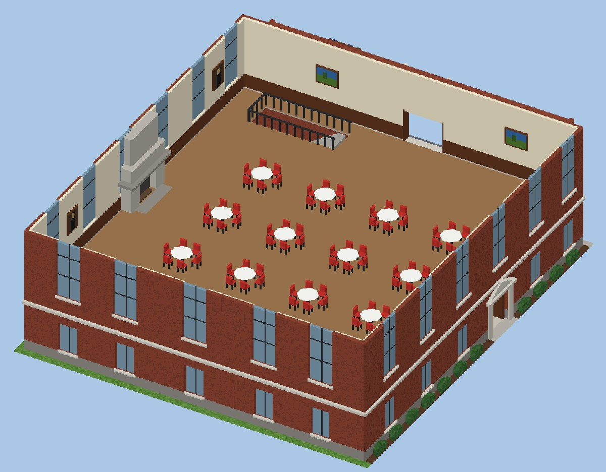
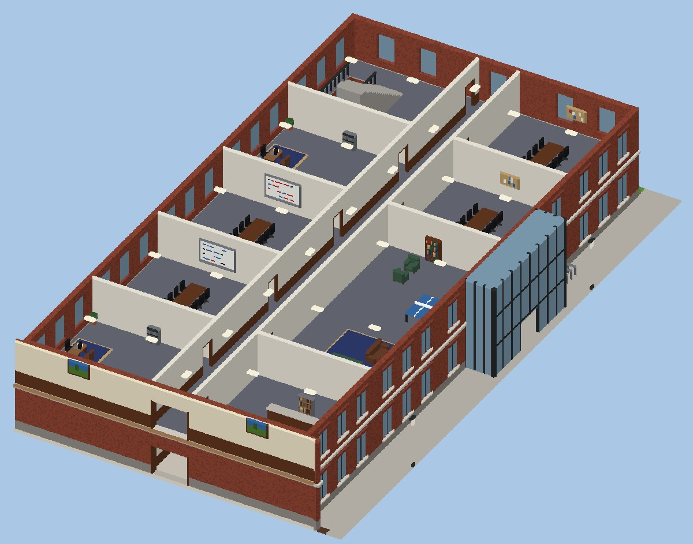

# Clark University — Teardown 地图

一张可以随便拆的 [Teardown](https://teardowngame.com/) 地图，场景是马萨诸塞州伍斯特的 Clark University 校园核心区。布局是照着 Apple Maps 的 3D 航拍图摆的。



## 布局

从 Main Street 看向校园：

```
          +--------------------------------------------------------+
          | [塔]           Jonas Clark Hall (1887)           [塔] |
          +--------------------------+-----------------------------+
   +------+         花坛      [钟楼 / 大门]      花坛
   |  UC  |                Red Square（Freud 雕像）
   | 1990 |   ~~~~~~~~~~~~~~ 草坪（The Green），大树 ~~~~~~~~~~~~~~
   +------+                          |  主路
   |Tilton|                          |
   | Hall |                    [ "C" 大门 ]
   +------+ ======================================================= 人行道
                       Main Street（公交/自行车道 + 4 车道）
```

- **Jonas Clark Hall** 正对 Main Street，中间隔着大草坪。大门、草坪中间的主路和楼的正门在同一条中轴线上。
- **Higgins University Center** 在草坪左侧（从大门看过去），从 Main Street 一直往后延伸到 Jonas Clark Hall 旁边：
  - 靠马路的一头是 **Tilton Hall**（老图书馆，四坡屋顶，二楼是拱顶大厅）；
  - 后面是 1990 年建的四层主楼，玻璃门厅朝着草坪。
- 草坪上的步道、树的位置，以及 JCH 门前的石材广场（Red Square）和两侧花坛，都是从航拍图上量出来的。

## 包含内容

| 地点 | 说明 |
|---|---|
| **Main Street** | 4 车道 + 公交/自行车道，有双黄线、红色人行横道（带路缘外扩）、路灯、公交站、消防栓、邮筒。 |
| **大门** | 人行道边的红砖弧形小广场。两根砖柱，中间是铁艺拱门，拱门上有金色的 "C"。 |
| **Jonas Clark Hall**（1887） | 长 62.5 m、进深 20 m（205 × 65 英尺），比例按这个尺寸做：<br>• 一楼是浅色石材基座；两翼四层，二、四层方窗，三层圆拱窗，窗框和腰线都是白色。<br>• 立面用壁柱分成一个个开间，壁柱伸出檐口变成小尖塔。<br>• 中间高一层，顶上是钟面，下面刻着 **CLARK / UNIVERSITY / 1887**。<br>• 两端也各高一层。 |
| **Tilton Hall** | 红砖老图书馆。二楼大厅有高拱窗，四坡石板瓦屋顶，朝草坪那面有带圆窗的山墙和石框大门。 |
| **University Center** | 四层红砖楼，平屋顶，屋顶上有空调机组和楼梯间。朝草坪的一面是两层高的玻璃门厅，上面写着 "UNIVERSITY CENTER"。 |
| **草坪和树** | 一棵棵大橡树、枫树按航拍位置种。JCH 门前花坛里有小观赏树和红叶槭，楼边有灌木。步道两边有路灯、长椅，还有一个树下的小圆形休息区。 |
| **Red Square + Freud** | JCH 门前的石板广场，中间是一块红砖方块，四周有长椅。弗洛伊德青铜像坐在广场前沿的矮墙上看书。 |

## 室内（都可以进去，都能拆）

**Jonas Clark Hall**（中间走廊、两边房间，楼梯在中央大厅后面，可以一直上到钟楼下面那层）：

- **一楼**：门厅（红地毯、展示柜、肖像画）、教室（黑板、讲台、课桌椅）、办公室、会议室
- **二楼**：教室、院长办公室、复印室
- **三楼**：校长办公室（大办公桌、书柜、沙发、红地毯、旗子）、会议室、教室
- **四楼**：研讨室、阅览室（书架和阅读桌）、教室
- **钟楼下面一层**：1909 年 Freud 讲座的小展厅（讲台、椅子、展示柜）；两端塔楼里是小休息室
- 走廊有木墙裙和公告板，窗下有暖气片，每个房间有吊灯

**Tilton Hall + University Center**：

- **Tilton Hall 一楼**：门厅（红色 "C" 地毯、服务台）、Bistro 咖啡吧（吧台、咖啡机、甜点柜、高脚凳、小桌）
- **Tilton Hall 二楼**：**Great Room**，11 m 高拱顶、木地板、花岗岩壁炉、舞台、三角钢琴、讲台、宴会圆桌、吊灯
- **UC 一楼**：The Table 餐厅（长桌、取餐台）、后厨、休息区、储藏室
- **UC 二楼**：收发室（整面墙的铜信箱）、学生休息室（沙发、电视、乒乓球台）、会议室
- **UC 三、四楼**：学生会、校报 The Scarlet 编辑部、台球/街机游戏室、会议室、办公室

| | |
|---|---|
|  |  |
|  |  |
|  |  |
|  |  |
|  | |

## 安装

把 `ClarkUniversity/` 整个文件夹复制到：

```
Documents/Teardown/mods/ClarkUniversity/
```

然后在游戏里打开 **Mod Manager → Local files → Clark University → Play**。
出生点在大门外的人行道上，面朝 Jonas Clark Hall。

## 道具和联机

- `ClarkUniversity/main.lua` 是地图脚本：进图后会给每个玩家所有工具和大量弹药（每秒检查一次，后加入的玩家也有）。
- `info.txt` 里有 `version = 2`，表示这是支持联机的 mod；`main.xml` 里有 12 个 `playerspawn` 出生点，用于联机模式。
- 改完文件后要在游戏的 Mod Manager 里**更新**已发布的创意工坊物品，联机的朋友需要重新订阅/更新。

## 重新生成 / 修改

```bash
pip install -r tools/requirements.txt
python3 tools/generate_map.py          # 输出到 ClarkUniversity/ 和 docs/
```

- `tools/vox_lib.py`：通用工具，包括体素网格、调色板、基本形状、文字、楼梯、家具零件、房间摆放（`Room`）、树、`.vox` 导出和预览渲染。
- `tools/generate_map.py`：Clark 校园本身，包括楼、室内布置、马路、步道、树的位置（`TREES` 列表）。
- 场景先在一个 1408 × 1280 × 256 的体素网格里搭好（1 voxel = 0.1 m），再切成 128³ 的 MagicaVoxel 分块，一共约 1550 万个体素。所有分块尺寸完全一样，拼起来不会错位。
- 地面是 `main.xml` 里的 `<voxbox>`（泥土，底下垫一层 hard masonry），每边都比地图大 15 m。
- 坐标对应关系：网格 (x 沿 Main Street, y 远离马路, z 上) → Teardown (x, z, −y)。

### 材质（调色板索引）

Teardown 是按调色板的**索引号**来决定材质的：

| 索引 | 材质 | 用在哪里 |
|---|---|---|
| 1–8 | 玻璃 | 窗户、展示柜、玻璃门厅 |
| 9–24 | 草 | 草坪 |
| 25–40 | 泥土 | 树坑、花坛 |
| 41–56 | 岩石 | 石材基座、广场石板、路缘石、石板屋顶、黑板、壁炉 |
| 57–72 | 木头 | 树干、家具、门框、木地板、书 |
| 73–88 | 混凝土 | 马路、人行道、步道、楼板、楼梯、标线 |
| 89–104 | 砖 | 外墙、门柱、红砖铺地 |
| 105–120 | 灰泥 | 室内墙、檐口、白色腰线、拱顶 |
| 121–136 | 金属 | 路灯、暖气片、铁艺大门、厨房设备、空调机组 |
| 137–152 | 硬金属 | Freud 青铜像、大门上的 "C"、信箱 |
| 153–168 | 塑料 | 灯、椅子、沙发、地毯、电脑、钢琴、钟面 |
| 225–240 | 植被 | 树叶、灌木 |

## 说明

- 楼和步道的**位置、朝向和大小**是照着航拍截图换算的。JCH 的尺寸用的是公开资料里的 205 × 65 英尺，其余尺寸是按比例估的。窗户数量、立面细节对照了航拍图，室内布置是我自己设计的，不是真实平面图。
- 只做了 Jonas Clark Hall、University Center（含 Tilton Hall）、门前草坪、大门和马路。草坪北边那几栋楼、马路对面的楼、JCH 后面的楼都没有做，那些地方现在是空草地。
- Freud 雕像比真人大约放大了 1.8 倍，否则在 0.1 m 的体素精度下几乎看不出形状。
- 家具和整栋楼连在一起（静态），被炸断之后才会掉下来。
- 已经在 Teardown 里实际加载过：第一版分块整体低了 6.4 m（Teardown 以模型中心定位 `.vox`），已在 `export()` 里修正。如果还发现材质不对，可以改 `vox_lib.py` 里的 `PALETTE` 后重新生成。
