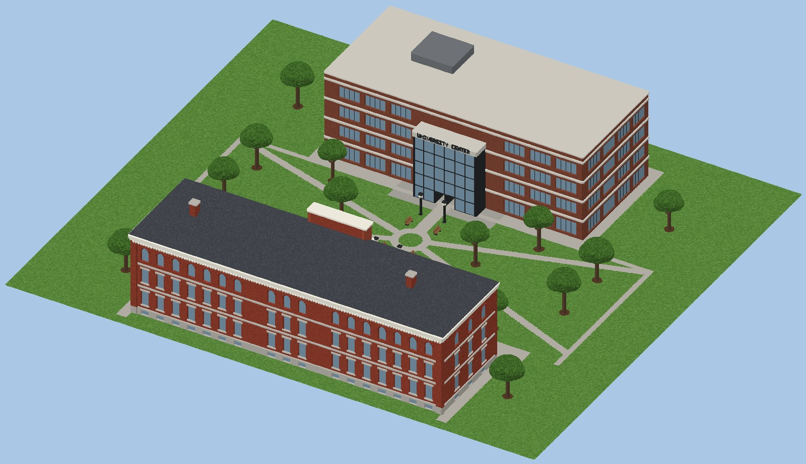

# Clark University — Teardown 地图

一张可以随便拆的 [Teardown](https://teardowngame.com/) 地图，场景是马萨诸塞州伍斯特的 Clark University 校园核心区。


## 包含内容

| 地点 | 说明 |
|---|---|
| **Jonas Clark Hall**（1887） | 红砖主楼，约 60 m × 18 m。花岗岩半地下室，三层楼：一、二层是带石过梁的方窗，三层是罗马式圆拱窗。白色檐口加齿饰，石板四坡屋顶。中央凸出的开间有拱形大门、花岗岩台阶，门上叠着三块花岗岩石块，分别刻着 **CLARK / UNIVERSITY / 1887**。屋顶上的小阁楼和半圆窗，是在呼应 1924 年被风暴吹倒的钟楼。楼里每层有楼板、走廊、房间隔墙和楼梯。 |
| **Higgins University Center** | 四层砖楼，约 50 m × 22 m。每层有混凝土横带和条形窗，朝向草坪的一面是通高的玻璃中庭入口，上面写着 "UNIVERSITY CENTER"。平屋顶上有设备间。楼里有楼梯、走廊和一楼餐厅。 |
| **The Green（草坪）** | 两栋楼之间的大草坪，有十字和对角线步道、中央环形小广场、树、路灯和长椅。 |
| **Red Square** | Jonas Clark Hall 门前的红砖广场。 |
| **Freud 雕像** | 弗洛伊德的青铜坐像，坐在 Red Square 边上的花岗岩矮墙上低头看书（纪念 1909 年他在 Clark 的讲座）。 |

<p>
  
</p>

## 安装

把 `ClarkUniversity/` 整个文件夹复制到：

```
Documents/Teardown/mods/ClarkUniversity/
```

然后在游戏里打开 **Mod Manager → Local files → Clark University → Play**。
出生点在草坪的中央步道上，面朝 Jonas Clark Hall。

## 重新生成 / 修改

整张地图都是 `tools/generate_map.py` 用代码生成的（1 voxel = 0.1 m）：

```bash
pip install -r tools/requirements.txt
python3 tools/generate_map.py          # 输出到 ClarkUniversity/ 和 docs/
```

- 场景先在一个 1024 × 896 × 256 的体素网格里搭好，再切成 128³ 的 MagicaVoxel 分块（`ClarkUniversity/vox/c_X_Y_Z.vox`）。所有分块尺寸完全一样，所以拼起来不会错位。
- 地面是 `main.xml` 里的 `<voxbox>`（泥土，底下垫一层 hard masonry），每边都比地图大 15 m。
- 坐标对应关系：网格 (x 东, y 北, z 上) → Teardown (x, z, −y)。

### 材质（调色板索引）

Teardown 是按调色板的**索引号**来决定材质的：

| 索引 | 材质 | 用在哪里 |
|---|---|---|
| 1–8 | 玻璃 | 窗户、UC 中庭 |
| 9–24 | 草 | 草坪 |
| 25–40 | 泥土 | 树坑、花坛 |
| 41–56 | 岩石 | 花岗岩基座、台阶、刻字石块、石板屋顶、雕像矮墙 |
| 57–72 | 木头 | 树干、长椅、木地板 |
| 73–88 | 混凝土 | 步道、楼板、楼梯、UC 横带 |
| 89–104 | 砖 | 两栋楼的外墙、Red Square 地砖 |
| 105–120 | 灰泥 | 室内隔墙、檐口 |
| 121–136 | 金属 | 路灯、窗框、设备间 |
| 137–152 | 硬金属 | Freud 青铜像 |
| 153–168 | 塑料 | 灯罩 |
| 225–240 | 植被 | 树冠、矮树篱 |

## 说明

- 建筑是照着照片和介绍**大致还原**的，没有用真实的测绘图纸。为了把两栋楼和草坪放进一张紧凑的地图，楼的位置和朝向也做了简化。
- Freud 雕像比真人大约放大了 1.8 倍，否则在 0.1 m 的体素精度下几乎看不出形状。
- 这张地图是在容器里生成和检查的（文件格式校验 + 上面的预览渲染），**还没有在真正的 Teardown 里跑过**。如果进游戏后发现建筑和地面有偏移、材质不对，可以改 `generate_map.py` 里的 `export()`（分块位置）或 `PALETTE` 段落，然后重新生成。
