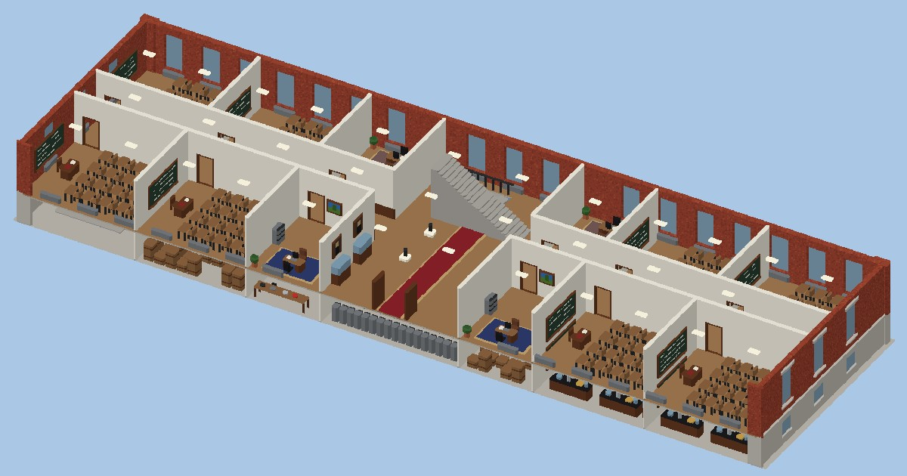
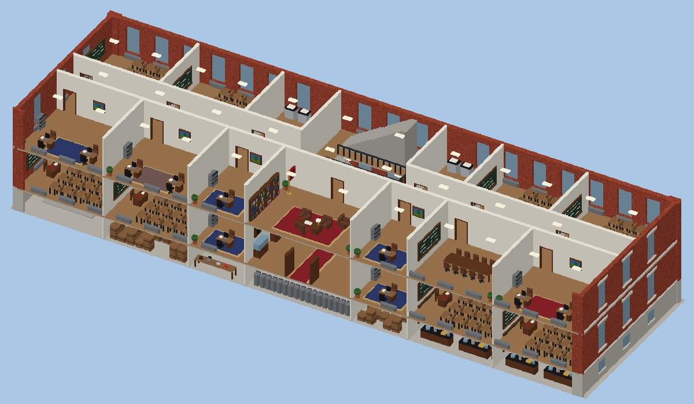
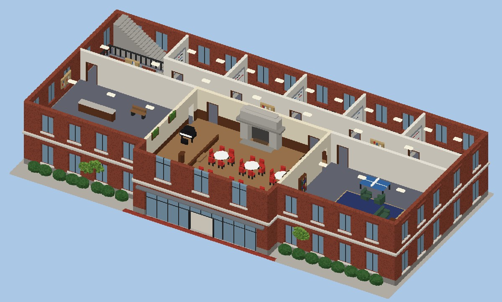
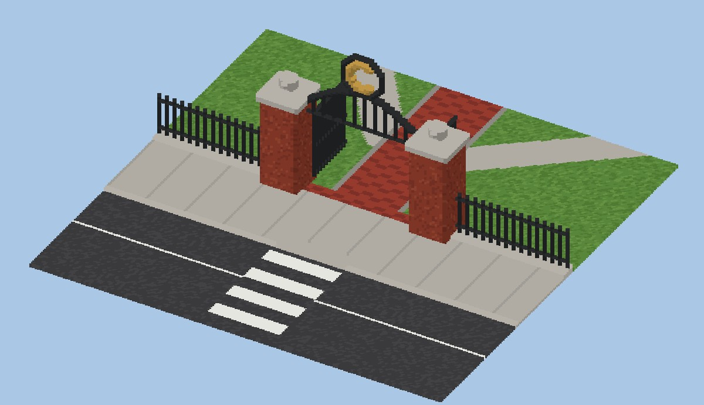
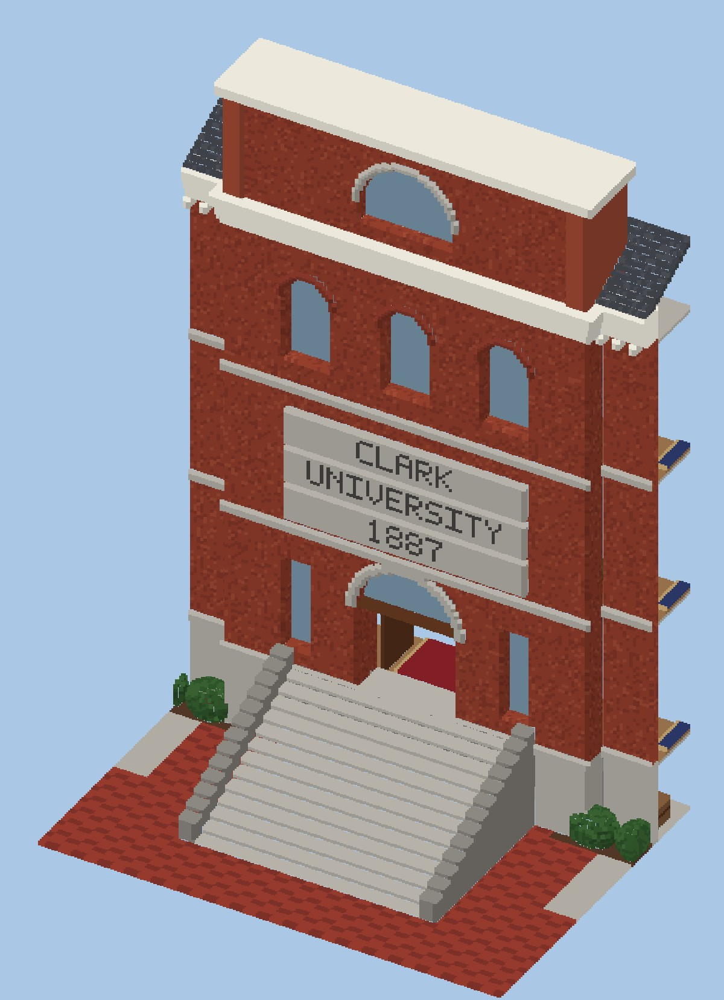
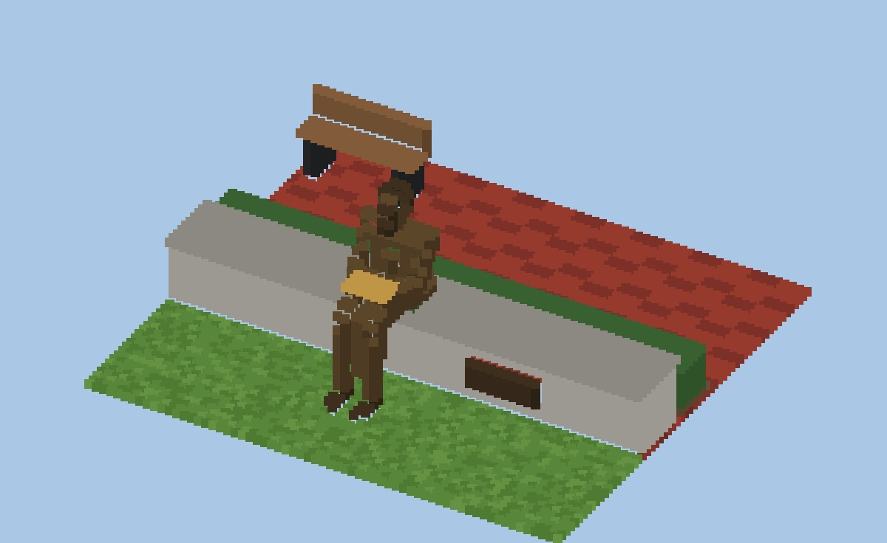

# Clark University — Teardown 地图

一张可以随便拆的 [Teardown](https://teardowngame.com/) 地图，场景是马萨诸塞州伍斯特的 Clark University 校园核心区。


## 布局

从 Main Street 看向校园：

```
   +--------------------------+        +---------------------+
   |     Jonas Clark Hall     |        | Higgins Univ. Center|
   +------------+-------------+        +---------+-----------+
        Red Square / Freud 雕像                  广场
   ~~~~~~~~~~~~~~~~~~~~~~ 草坪（The Green，有树） ~~~~~~~~~~~~~~~~~~~
   ======== 铁栅栏 ======= [ "C" 大门 ] ========= [ 小门 ] ========
   ---------------------------- Main Street --------------------------
```

- Jonas Clark Hall 朝向 Main Street，正对着大门和马路，中间隔着草坪。
- University Center 在 Jonas Clark Hall 的**右边**（从大门看过去），同样朝向草坪和马路。

## 包含内容

| 地点 | 说明 |
|---|---|
| **Main Street** | 双向马路：双黄线、路边停车线、人行横道、两侧人行道（带路缘石）、路灯、消防栓、蓝色邮筒。 |
| **大门和围栏** | 铁栅栏沿街排开，中间是砖砌门柱。主大门正对 Jonas Clark Hall，上面有铁艺拱门和金色的 "C"，门扇是打开的。University Center 前面另有一个小门。 |
| **Jonas Clark Hall**（1887） | 红砖主楼。花岗岩半地下室，一、二层是方窗，三层是罗马式圆拱窗，有白色檐口和石板屋顶。中间凸出一块，13 级花岗岩台阶上去就是大门，门上刻着 **CLARK / UNIVERSITY / 1887**。 |
| **Higgins University Center** | 红砖四层楼，有石材横带和坡屋顶。正中是 Tilton Hall 的山墙，开三扇高拱窗，山墙上有圆窗。一楼是玻璃门面，雨棚上写着 "HIGGINS UNIVERSITY CENTER"。 |
| **草坪和树** | 草坪上有砖铺主路、对角线步道、路灯、长椅和垃圾桶。树有好几种：沿围栏和草坪上的大橡树、枫树，Red Square 两边的红叶鸡爪槭，楼角的云杉，UC 门口的小观赏树，马路边的行道树。楼前还有灌木。 |
| **Red Square + Freud** | Jonas Clark Hall 门前是红砖广场，弗洛伊德青铜坐像在矮墙上看书。 |

## 室内（都可以进去，都能拆）

**Jonas Clark Hall**（中间走廊，两边是房间，楼梯在中央大厅后面）：

- **地下室**：锅炉房（锅炉、水箱、管道）、老心理学实验室（实验台、黄铜仪器）、档案室、工作间、储藏室
- **一楼**：门厅（红地毯、展示柜、肖像画）、教室（黑板、讲台、16 套课桌椅）、办公室
- **二楼**：校长办公室（大办公桌、书柜、沙发、红地毯、旗子）、办公室、会议室、复印室、教室
- **三楼**：研讨室、阅览室（书架和阅读桌）、教室、办公室
- 走廊有木墙裙和公告板，窗下有暖气片，每个房间有吊灯

**Higgins University Center**：

- **一楼**：大堂（地上有红色 "C" 地毯，有服务台、沙发、电子屏）、Bistro 咖啡厅（吧台、咖啡机、甜点柜、高脚凳、小桌）、餐厅 The Table（长桌、红椅子、取餐台）、后厨（灶台、冰箱、不锈钢台面）、游戏室（台球桌、街机）、自动售货机区
- **二楼**：**Tilton Hall**（三层高的拱顶大厅、木地板、花岗岩壁炉、舞台、三角钢琴、讲台、宴会圆桌、吊灯）、收发室（整面墙的铜信箱）、学生休息室（沙发、电视、乒乓球台）、会议室
- **三、四楼**：学生社团会议室、学生会办公室、校报 The Scarlet 编辑部、办公室

| | |
|---|---|
|  |  |
|  |  |
|  |  |
|  |  |

## 安装

把 `ClarkUniversity/` 整个文件夹复制到：

```
Documents/Teardown/mods/ClarkUniversity/
```

然后在游戏里打开 **Mod Manager → Local files → Clark University → Play**。
出生点在大门外的人行道上，面朝校园。

## 重新生成 / 修改

整张地图都是 `tools/generate_map.py` 用代码生成的（1 voxel = 0.1 m）：

```bash
pip install -r tools/requirements.txt
python3 tools/generate_map.py          # 输出到 ClarkUniversity/ 和 docs/
```

- 场景先在一个 1408 × 1024 × 256 的体素网格里搭好，再切成 128³ 的 MagicaVoxel 分块（`ClarkUniversity/vox/c_X_Y_Z.vox`），一共约 1000 万个体素。所有分块尺寸完全一样，拼起来不会错位。
- 地面是 `main.xml` 里的 `<voxbox>`（泥土，底下垫一层 hard masonry），每边都比地图大 15 m。
- 坐标对应关系：网格 (x 东, y 北/远离马路, z 上) → Teardown (x, z, −y)。
- 家具都写成"零件列表"（见 `chair()`、`office_desk()`、`bookshelf()` 等），用 `place()` 可以朝四个方向摆放。房间的布置写在 `furnish_jch()` 和 `furnish_uc()` 里。
- 树的位置在 `TREES` 列表里，想加树、挪树改这个列表就行。

### 材质（调色板索引）

Teardown 是按调色板的**索引号**来决定材质的：

| 索引 | 材质 | 用在哪里 |
|---|---|---|
| 1–8 | 玻璃 | 窗户、展示柜、UC 门面 |
| 9–24 | 草 | 草坪 |
| 25–40 | 泥土 | 树坑、花坛 |
| 41–56 | 岩石 | 花岗岩、台阶、路缘石、石板屋顶、黑板、壁炉 |
| 57–72 | 木头 | 树干、家具、门框、木地板、书 |
| 73–88 | 混凝土 | 马路、人行道、楼板、楼梯、标线 |
| 89–104 | 砖 | 外墙、门柱、Red Square 地砖 |
| 105–120 | 灰泥 | 室内墙、檐口、拱顶 |
| 121–136 | 金属 | 栅栏、路灯、暖气片、UC 屋顶、厨房设备 |
| 137–152 | 硬金属 | Freud 青铜像、大门上的 "C"、信箱 |
| 153–168 | 塑料 | 灯、椅子、沙发、地毯、电脑、钢琴 |
| 225–240 | 植被 | 树叶、灌木 |

## 说明

- 建筑是照着网上的照片和介绍**大致还原**的，没有用测绘图纸。草坪、大门、马路和两栋楼的位置关系是按实际校园摆的。各栋楼的尺寸、窗户数量和室内布置是我自己设计的，不是真实平面图。
- Freud 雕像比真人大约放大了 1.8 倍，否则在 0.1 m 的体素精度下几乎看不出形状。
- 家具和整栋楼连在一起（静态），被炸断之后才会掉下来。
- 这张地图是在容器里生成和检查的（文件格式校验 + 上面的渲染图），**还没有在真正的 Teardown 里跑过**。如果进游戏后发现建筑和地面有偏移、材质不对，可以改 `generate_map.py` 里的 `export()`（分块位置）或 `PALETTE` 段落，然后重新生成。
