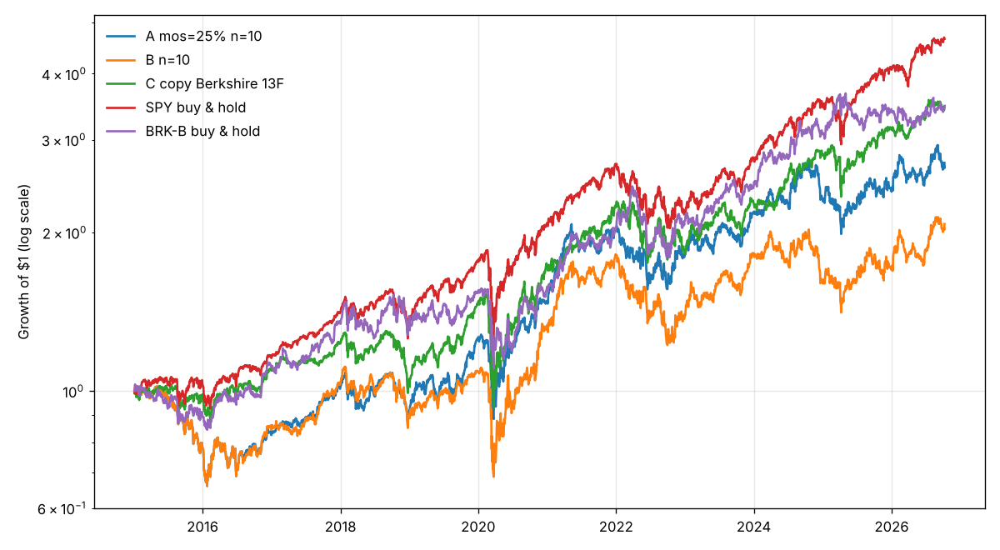

# 回测结果（截至 2026-10-09）

## 各策略表现

| strategy             | total_return   | cagr   | volatility   | max_drawdown   |   sharpe | start      | end        |   trades |
|:---------------------|:---------------|:-------|:-------------|:---------------|---------:|:-----------|:-----------|---------:|
| A mos=15% n=8        | 188.2%         | 9.4%   | 21.3%        | -35.6%         |     0.44 | 2015-01-05 | 2026-10-08 |      106 |
| A mos=25% n=8        | 138.0%         | 7.7%   | 21.0%        | -38.6%         |     0.36 | 2015-01-05 | 2026-10-08 |      100 |
| A mos=35% n=8        | 144.8%         | 7.9%   | 20.6%        | -36.6%         |     0.38 | 2015-01-05 | 2026-10-08 |       84 |
| B n=8                | 115.4%         | 6.7%   | 22.0%        | -38.6%         |     0.32 | 2015-01-05 | 2026-10-08 |      120 |
| A mos=15% n=10       | 193.2%         | 9.6%   | 20.4%        | -35.5%         |     0.46 | 2015-01-05 | 2026-10-08 |      130 |
| A mos=25% n=10       | 171.1%         | 8.9%   | 19.7%        | -35.3%         |     0.43 | 2015-01-05 | 2026-10-08 |      118 |
| A mos=35% n=10       | 198.7%         | 9.8%   | 18.9%        | -31.6%         |     0.49 | 2015-01-05 | 2026-10-08 |      104 |
| B n=10               | 107.6%         | 6.4%   | 21.0%        | -38.2%         |     0.31 | 2015-01-05 | 2026-10-08 |      144 |
| A mos=15% n=15       | 193.0%         | 9.6%   | 18.6%        | -30.0%         |     0.48 | 2015-01-05 | 2026-10-08 |      171 |
| A mos=25% n=15       | 216.9%         | 10.3%  | 18.1%        | -31.3%         |     0.53 | 2015-01-05 | 2026-10-08 |      160 |
| A mos=35% n=15       | 185.9%         | 9.3%   | 15.8%        | -25.7%         |     0.52 | 2015-01-05 | 2026-10-08 |      129 |
| B n=15               | 180.3%         | 9.2%   | 19.5%        | -36.3%         |     0.45 | 2015-01-05 | 2026-10-08 |      199 |
| C copy Berkshire 13F | 246.8%         | 11.2%  | 19.3%        | -39.1%         |     0.54 | 2015-01-05 | 2026-10-08 |     1872 |
| SPY buy & hold       | 365.6%         | 14.0%  | 17.5%        | -33.7%         |     0.73 | 2015-01-05 | 2026-10-08 |        0 |
| BRK-B buy & hold     | 247.7%         | 11.2%  | 19.0%        | -29.6%         |     0.55 | 2015-01-05 | 2026-10-08 |        0 |

## 逐年收益

|      | A mos=15% n=8   | A mos=25% n=8   | A mos=35% n=8   | B n=8   | A mos=15% n=10   | A mos=25% n=10   | A mos=35% n=10   | B n=10   | A mos=15% n=15   | A mos=25% n=15   | A mos=35% n=15   | B n=15   | C copy Berkshire 13F   | SPY buy & hold   | BRK-B buy & hold   |
|-----:|:----------------|:----------------|:----------------|:--------|:-----------------|:-----------------|:-----------------|:---------|:-----------------|:-----------------|:-----------------|:---------|:-----------------------|:-----------------|:-------------------|
| 2015 | -20.0%          | -24.3%          | -23.0%          | -24.3%  | -15.8%           | -21.8%           | -17.9%           | -21.8%   | -15.9%           | -15.4%           | -12.1%           | -15.4%   | -3.0%                  | 3.2%             | -10.2%             |
| 2016 | 18.1%           | 6.6%            | 7.0%            | 6.9%    | 10.9%            | 5.6%             | 8.7%             | 8.1%     | 12.2%            | 9.6%             | 3.0%             | 11.6%    | 12.8%                  | 12.0%            | 23.4%              |
| 2017 | 22.7%           | 21.4%           | 14.2%           | 21.9%   | 27.0%            | 22.4%            | 16.6%            | 21.7%    | 22.3%            | 19.3%            | 11.5%            | 24.4%    | 12.4%                  | 21.7%            | 21.6%              |
| 2018 | -12.4%          | -10.5%          | -9.6%           | -12.7%  | -10.2%           | -9.3%            | -8.3%            | -12.8%   | -7.7%            | -4.3%            | -5.2%            | -11.7%   | -14.6%                 | -4.6%            | 3.0%               |
| 2019 | 35.3%           | 26.3%           | 38.5%           | 27.7%   | 29.1%            | 37.0%            | 47.7%            | 21.6%    | 33.9%            | 32.8%            | 35.7%            | 29.6%    | 39.8%                  | 31.2%            | 10.9%              |
| 2020 | 17.8%           | 14.8%           | 7.8%            | 26.0%   | 20.8%            | 18.1%            | 12.5%            | 22.3%    | 19.0%            | 21.6%            | 17.8%            | 22.9%    | 18.0%                  | 18.3%            | 2.4%               |
| 2021 | 35.5%           | 37.7%           | 39.8%           | 39.5%   | 30.4%            | 37.7%            | 37.8%            | 35.8%    | 30.3%            | 32.8%            | 30.2%            | 34.9%    | 28.9%                  | 28.7%            | 29.0%              |
| 2022 | -11.3%          | -11.7%          | -11.5%          | -25.1%  | -7.6%            | -11.2%           | -9.6%            | -23.3%   | -5.7%            | -7.2%            | -6.0%            | -19.6%   | -16.7%                 | -18.2%           | 3.3%               |
| 2023 | 15.9%           | 19.2%           | 20.7%           | 39.6%   | 18.0%            | 19.9%            | 20.3%            | 30.9%    | 17.6%            | 22.2%            | 27.6%            | 26.0%    | 23.3%                  | 26.2%            | 15.5%              |
| 2024 | 7.4%            | 9.7%            | 9.7%            | -10.0%  | 5.7%             | 6.6%             | 6.5%             | -11.2%   | 2.3%             | 2.2%             | 0.5%             | -5.6%    | 22.7%                  | 24.9%            | 27.1%              |
| 2025 | 1.5%            | 3.7%            | 3.6%            | 3.6%    | 2.1%             | 3.2%             | 3.4%             | 5.1%     | 2.3%             | 4.1%             | 12.6%            | 9.7%     | 11.4%                  | 17.7%            | 10.9%              |
| 2026 | 17.3%           | 13.7%           | 13.6%           | 14.3%   | 15.0%            | 13.4%            | 14.2%            | 22.3%    | 13.9%            | 15.8%            | 5.7%             | 19.9%    | 10.6%                  | 14.4%            | 1.7%               |

## 今日持仓（按 A mos=25% n=10 的规则）

阈值：roe_avg=0.15，roe_floor=0.12，debt_years=3，mos=0.25

| ticker   |   price |   intrinsic_value_per_share |   margin_of_safety |   roe_avg_5y |   debt_years |    pe |   p_owner_earnings |   weight |
|:---------|--------:|----------------------------:|-------------------:|-------------:|-------------:|------:|-------------------:|---------:|
| CF       |   114   |                       297   |              0.617 |        0.47  |       1.89   |  9.72 |               8.98 |      0.1 |
| DECK     |    82.6 |                       160   |              0.484 |        0.367 |       0      | 11.2  |              12.7  |      0.1 |
| PHM      |   114   |                       207   |              0.452 |        0.263 |       0.0167 |  9.75 |               8.27 |      0.1 |
| ADBE     |   241   |                       415   |              0.42  |        0.389 |       1.03   | 13.4  |              14.3  |      0.1 |
| EOG      |   149   |                       241   |              0.385 |        0.246 |       1.25   | 15.8  |               8.2  |      0.1 |
| SLB      |    49   |                        76.3 |              0.358 |        0.186 |       2.43   | 21.9  |              15.9  |      0.1 |
| FDS      |   287   |                       395   |              0.275 |        0.334 |       2.56   | 17.4  |              17.9  |      0.1 |

## 伯克希尔真实买入时的指标（2009 年后、非金融股）

|       |   roe_avg |   roe_min |   debt_years |       mos |    pe |   p_oe |
|:------|----------:|----------:|-------------:|----------:|------:|-------:|
| count |   51      |   51      |        52    |   52      | 49    |   46   |
| mean  |    0.351  |    0.0806 |       inf    | -inf      | 22.9  |   31.6 |
| std   |    0.498  |    0.254  |       nan    |  nan      | 19    |   50.5 |
| min   |   -0.0279 |   -0.711  |         0    | -inf      |  2.37 |    6.2 |
| 25%   |    0.125  |    0.0103 |         0.53 |   -1.29   |  8.64 |   10.1 |
| 50%   |    0.244  |    0.0901 |         2.88 |    0.0579 | 14.3  |   17.1 |
| 75%   |    0.403  |    0.191  |         7.3  |    0.41   | 29.6  |   31.5 |
| max   |    3.36   |    0.757  |       inf    |    0.724  | 88.6  |  325   |

## 数据检查

- 13F 文件 211 份；表内合计与封面总额相差 >1% 的：4 份
- 每个复查日的数据覆盖见 coverage.csv（最低 268 / 500 只有完整指标）
- 策略 C：13F 里找不到价格的持仓（多为已被收购的公司）按现金处理，平均占 1.9%，最多 6.5%
